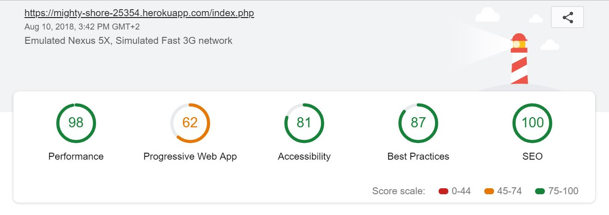

# Fil Rouge "Multipage Website"

- **Repository**: `Multipage-Website-in-php`
- **Team** : `In the group of 2 persons`

- **Duration** : `7 Days`

- **Done by**  
  - [Marie Louise Ogdoc](https://github.com/OGlou7)
  - [Mariane Niwemfura](https://github.com/MarianeNiwe)

- **When?**
        - From 30th July 2018 to 10th August 2018.

- **Where?**
        - A project done while in the training at [Becode](https://github.com/becodeorg/)

## About the Project

This project will helps us to learn how to realise a project in real situations, but will not be given to a any client. It is just an exercise from [BeCode](https://github.com/becodeorg/)
For this, we have to refresh an existing [website](http://www.abpasbl.be/-AMV-asbl-Bruxelles-), with several pages to separate the content and that the visitors to the website can send an email via a contact form with a small photo.

## Client

[**ABP - `Association Belge des Paralysés`**](http://www.abpasbl.be/-AMV-asbl-Bruxelles-)

## Objectives

The objective of this challenge is to give us the opportunity to use our new knowledge in PHP in a realistic scenario. It is therefore more important that each member of our team achieves her learning objectives than to succeed in the project.
And here come steps to follow:
- Use of **DRY** method
- Separate `php` from `html`
- Use of `.gitignore` file
- Contact page has to contain a form that will:
    * Allow user to choose their gender
    * Ask for user's name, last name and email
    * Allow user to write a message
    * Allow user to upload a jpg, gif or png
    * Allow user to choose between *html* and *txt*
- Uploading will be done with *php upload* class
- Email will be managed with *phpmailer* or another similar class
- Form will be sanitized, validated, executed and will provide feedback
- Form sending will be logged in a *.txt* file and a *.php* page (which will remove private data)
- Errors from user will dispatch appropriate messages
- Use CCS framwork to design responsive pages
- lighthouse test result of 80 in every category

## Instructions

We had at our disposal the [briefing](https://github.com/becodeorg/Johnson2/tree/master/projets/multipage-website-in-php) to realise this project.

## Visualisation of project's idea

### Web Mockup

### Contact Form Mockup

### UML flowchart for contact form
-Page-1.png)

## Workflow

* We met up the 1st day for a half day to figure out how to work on this project and discussed about the objectives and various tasks we were going to do to accomplish this project. We started with a brainstorming to better understand the over view of the project.
* We then created a mockup to visualize the project,choose a css bootstrap and finally draw an uml for our contact form scripts at this stage we had almost a good vision on what we were supposed to do for the whole project.
*  We created a Github repository, made a kanban for tasks,created branches(each created her own branch to work together).
* In order to work efficiently remotely, we used first create a kanban to have all tasks to be done and follow the progress of the project and created a team channel on Ryver.
* When the project was accomplished, we deployed it on Heroku.

## Problems encountered

* August 1st 2018,the original website was desactivated and we couldn't get some information we needed for our new project.

* Working remotly was not easy for us but we experience it and the next time we have to work on a project remotly we will have an strong experience.
* We didn't have any strong background in php and working directly on a `real` project where you have to use php was difficult and we had to search and search everything on internet and ask some of our collega and it tooks us time especially for contact form but was a good experience and we learn alot from this project.

##  New skills acquired from this project

* More Creative
* Learn remote work and use all tools to make a good communication
* How to use `include()`function in order to DRY and php classes
* Learn the php method of `validate`,`sanitize`,`execute` and `feedback`
* The use of `.gitignore` file
* How to make your website compatible with the RGPD/Cookies.

## Lighthouse Test

## Link to the final project

https://mighty-shore-25354.herokuapp.com/
