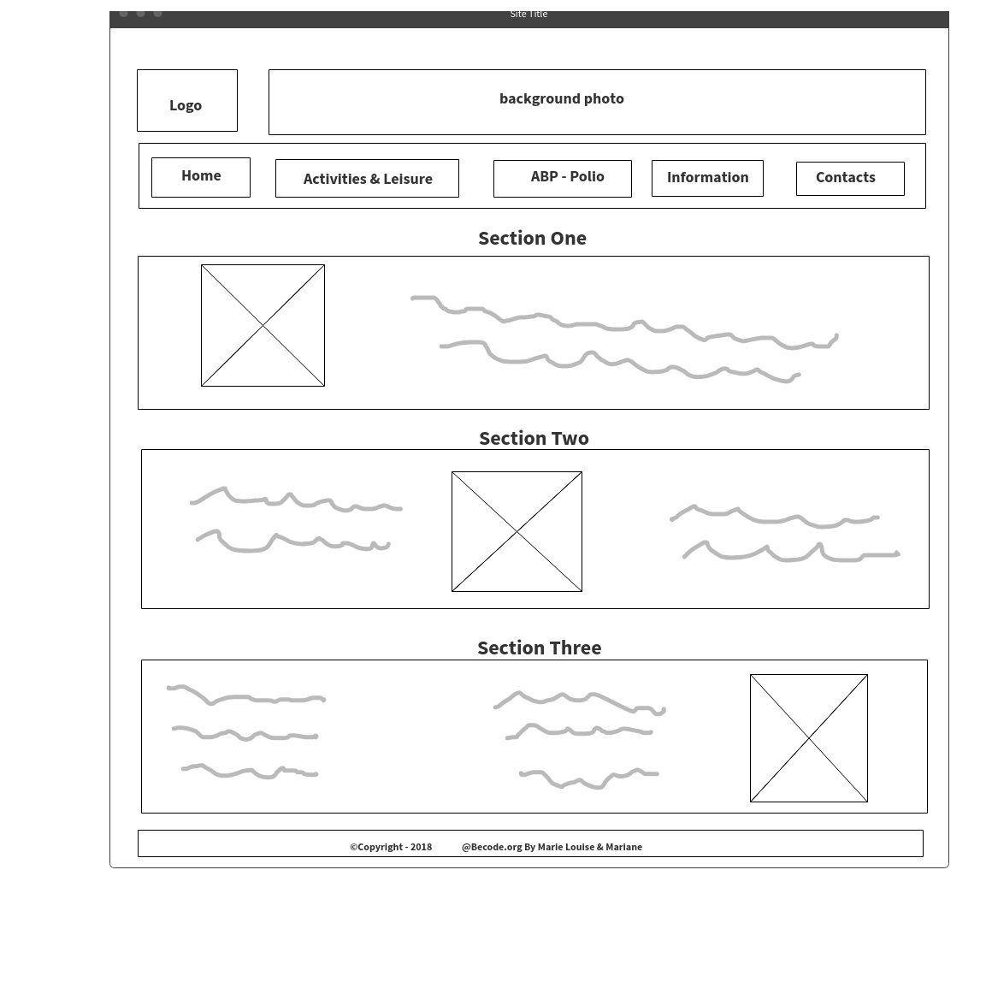

# Fil Rouge "Multipage Website"

- **Repository**: `Multipage-Website-in-php`
- **Team** : `In the group of 2 persons`

- **Duration** : `7 Days`

- **Done by**  
  - [Marie Louise Ogdoc](https://github.com/OGlou7)
  - [Mariane Niwemfura](https://github.com/MarianeNiwe)

- **When?**
        - From 30th July 2018 to 7th August 2018.

- **Where?**
        - A project done while in the training at [Becode](https://github.com/becodeorg/)

## About the Project

This project will helps us to learn how to realise a project in real situations, but will not be given to a any client. It is just an exercise from [BeCode](https://github.com/becodeorg/)
For this, we have to refresh an existing [website](http://www.abpasbl.be/-AMV-asbl-Bruxelles-), with several pages to separate the content and that the visitors to the website can send an email via a contact form with a small photo.

## Client

[**ABP - `Association Belge des Paralysés`**](http://www.abpasbl.be/-AMV-asbl-Bruxelles-)

## Objectives

The objective of this challenge is to give us the opportunity to use our new knowledge in PHP in a realistic scenario. It is therefore more important that each member of our team achieves her learning objectives than to succeed in the project.

## Instructions

We had at our disposal the [briefing](https://github.com/becodeorg/Johnson2/tree/master/projets/multipage-website-in-php) to realise this project.

## Visualisation of project's idea

**Web Mockup**

**Contact Form Mockup**

## Workflow

- `*1st step*`

- `*2nd step*`

- `*3rd step*`

- `*4th step*`

- `*5th step*`

## Problem encountered

* August 1st 2018 ABP desactivate their website
* Missing some info + img for our website
*
*

##  New skills acquired from this project
*
*
*
*

## Lighthouse Test

# Final resultat
